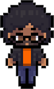

# Heya 👋, I'm Evan

[^1]
[^1]: Image generated using [MeniMeno](https://www.youtube.com/@MeniMenoHello)'s [Character Creator](https://menimeno.itch.io/menimenos-character-creator).

> [!NOTE]
> I'm a Full-Stack Software Engineer with 10 years of experience, focusing on UI/UX :desktop_computer:, CI/CD :arrows_counterclockwise:, & 3D visualization :movie_camera:.

## Languages and Tools

  <b>Primary / Recent</b>

  
  
  
  
  
  
  
  
  
  
  

  <b>Secondary / Misc.</b>

  
  
  
  
  
  
  
  
  
  
  
  
  & more

